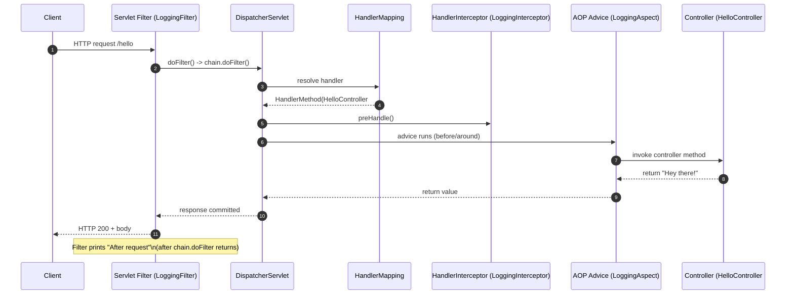
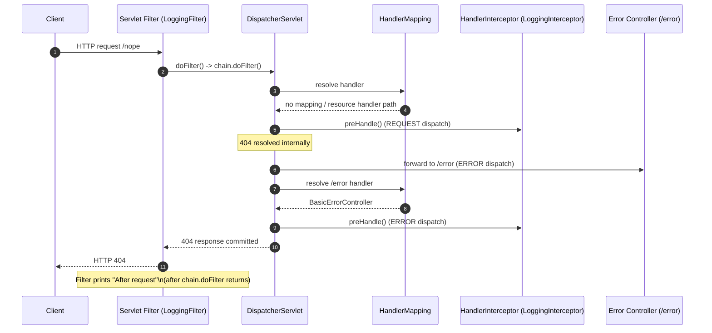

# Logs

---

## ✅ Existing API

Example: `http://localhost:8080/hello`

### 🔹 Filter (Before Request)

```text
=== Filter ===
Before request
When: 2026-02-14T15:46:53.731Z
Runtime class: com.johncnstn.spring.crosscutting_concerns.filter.LoggingFilter
Ultimate target class: com.johncnstn.spring.crosscutting_concerns.filter.LoggingFilter
Instance: com.johncnstn.spring.crosscutting_concerns.filter.LoggingFilter@413e4a24
=== end Filter ===
```

---

### 🔹 Interceptor

```text
=== Interceptor ===
When: 2026-02-14T15:46:53.739Z
Runtime class: com.johncnstn.spring.crosscutting_concerns.interceptor.LoggingInterceptor
Ultimate target class: com.johncnstn.spring.crosscutting_concerns.interceptor.LoggingInterceptor
Instance: com.johncnstn.spring.crosscutting_concerns.interceptor.LoggingInterceptor@44d48e9e
=== end Interceptor ===
```

---

### 🔹 Aspect (Advice Execution)

```text
=== Aspect (Advice) ===
When: 2026-02-14T15:46:53.745Z
Runtime class: com.johncnstn.spring.crosscutting_concerns.aop.LoggingAspect
Ultimate target class: com.johncnstn.spring.crosscutting_concerns.aop.LoggingAspect
Instance: com.johncnstn.spring.crosscutting_concerns.aop.LoggingAspect@bfa7aa4

Calling: com.johncnstn.spring.crosscutting_concerns.api.HelloController.sayHello
=== end Aspect ===
```

---

### 🔹 Filter (After Request)

```text
=== Filter ===
After request
When: 2026-02-14T15:46:53.753Z
Runtime class: com.johncnstn.spring.crosscutting_concerns.filter.LoggingFilter
Ultimate target class: com.johncnstn.spring.crosscutting_concerns.filter.LoggingFilter
Instance: com.johncnstn.spring.crosscutting_concerns.filter.LoggingFilter@413e4a24
=== end Filter ===
```

---

# ❌ Non-Existing Endpoint

### 🔹 Filter (Before Request)

```text
=== Filter ===
Before request
When: 2026-02-14T15:49:58.169Z
Runtime class: com.johncnstn.spring.crosscutting_concerns.filter.LoggingFilter
Ultimate target class: com.johncnstn.spring.crosscutting_concerns.filter.LoggingFilter
Instance: com.johncnstn.spring.crosscutting_concerns.filter.LoggingFilter@413e4a24
=== end Filter ===
```

---

### 🔹 Interceptor (First Dispatch)

```text
=== Interceptor ===
When: 2026-02-14T15:49:58.172Z
Runtime class: com.johncnstn.spring.crosscutting_concerns.interceptor.LoggingInterceptor
Ultimate target class: com.johncnstn.spring.crosscutting_concerns.interceptor.LoggingInterceptor
Instance: com.johncnstn.spring.crosscutting_concerns.interceptor.LoggingInterceptor@44d48e9e
=== end Interceptor ===
```

---

### 🔹 Filter (After Request)

```text
=== Filter ===
After request
When: 2026-02-14T15:49:58.175Z
Runtime class: com.johncnstn.spring.crosscutting_concerns.filter.LoggingFilter
Ultimate target class: com.johncnstn.spring.crosscutting_concerns.filter.LoggingFilter
Instance: com.johncnstn.spring.crosscutting_concerns.filter.LoggingFilter@413e4a24
=== end Filter ===
```

---

### 🔹 Interceptor (Error Dispatch)

```text
=== Interceptor ===
When: 2026-02-14T15:49:58.178Z
Runtime class: com.johncnstn.spring.crosscutting_concerns.interceptor.LoggingInterceptor
Ultimate target class: com.johncnstn.spring.crosscutting_concerns.interceptor.LoggingInterceptor
Instance: com.johncnstn.spring.crosscutting_concerns.interceptor.LoggingInterceptor@44d48e9e
=== end Interceptor ===
```

---

# 🔎 What Does This Mean?

```
Instance: com.johncnstn.spring.crosscutting_concerns.interceptor.LoggingInterceptor@44d48e9e
```

This is the default `toString()` implementation from `java.lang.Object`.

If you don’t override `toString()`, Java uses:

```java
getClass().

getName() +"@"+Integer.

toHexString(hashCode())
```

So the value:

```
44d48e9e
```

- ❌ Is NOT a memory address
- ❌ Is NOT random
- ✅ Is the object's identity hash code in hexadecimal form

Internally equivalent to:

```java
Integer.toHexString(System.identityHashCode(object))
```

Conceptually:

👉 It is simply a unique identity number for that object during that JVM run.

✅ Existing endpoint (GET /hello) — Filter + Interceptor + Aspect



✅ Missing endpoint (GET /nope) — Why Interceptor can run twice


**Interceptor may run multiple times because Spring can do multiple dispatches inside the same filter chain (REQUEST + ERROR)**

# Questions:

- How identity hash interacts with synchronized
- Why overriding hashCode() changes behavior